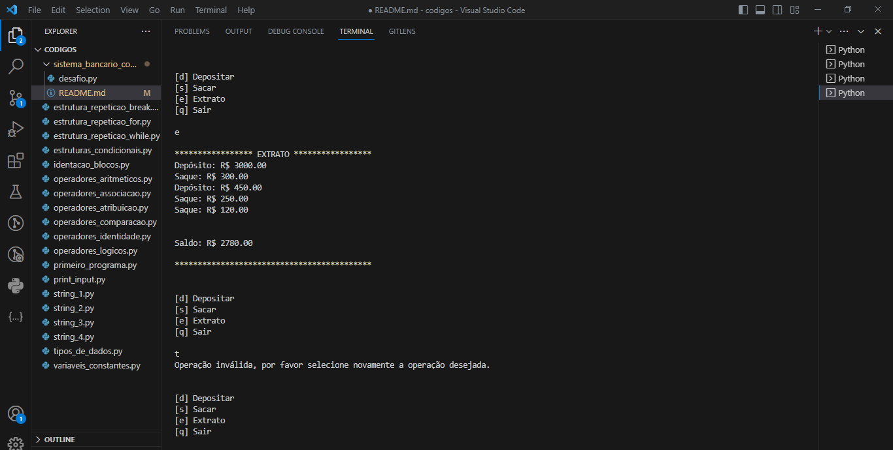

# criando-um-sistema-bancario-com-python-desafio-dio

Este repositório foi criado com o intuito de entregar o desafio proposto no bootcamp potência tech powered, iFood ciências de dados com Python. Cursado na plataforma dio.me, especialista que atua no curso: Guilherme Carvalho.

